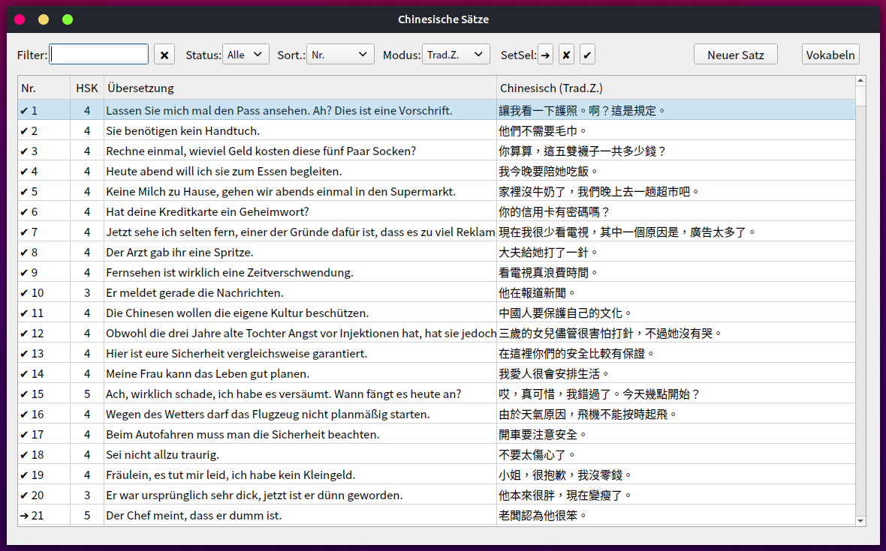
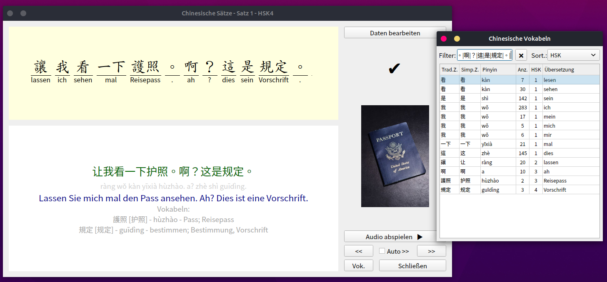
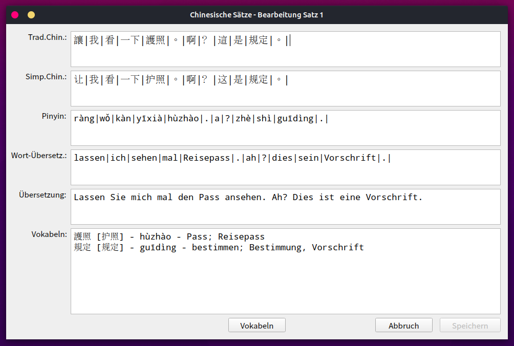

# Chinesische Sätze (Chinese Sentences)

A [GAMBAS (= Gambas Almost Means BASIC)](https://en.wikipedia.org/wiki/Gambas) 
Application to collect and train Chinese sentences (in German).

The media files are not part of this repository.

Screenshots:

-----

### Security Notice

The code I released here into the public domain may appear in third-party projects. I do not maintain, endorse, or have any affiliation with such projects. Any malicious or deceptive use is unauthorized and should be reported to the hosting platform.

-----